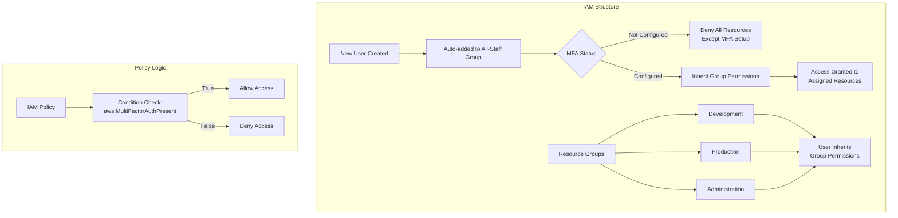
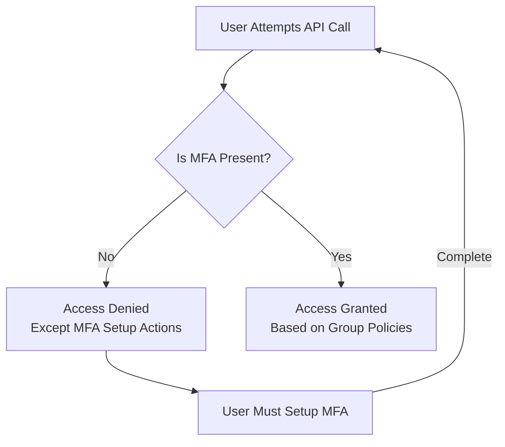

# IAM MFA Enforcement Setup

## 📋 Overview
This IAM setup enforces **Multi-Factor Authentication (MFA)** for all users before they can access any AWS resources. The system uses group-based permissions and conditional policies to ensure security compliance.

## 🎯 Key Features
- **MFA Enforcement**: No resource access without MFA setup
- **Group-Based Access Control**: Users inherit permissions through group membership
- **Automated User Onboarding**: New users automatically join the "All-Staff" group
- **Conditional Policies**: IAM policies require MFA for all API calls

## 🏗️ Architecture Diagram



## 📁 IAM Components

### 1. **All-Staff Group**
- **Name**: `All-Staff`
- **Purpose**: Default group for all employees
- **Policy**: Enforces MFA setup before resource access

### 2. **Resource Groups**
- **Development**: `Dev-Team` - Access to development resources
- **Production**: `Prod-Team` - Access to production resources  
- **Administration**: `Admin-Team` - Administrative privileges
- **Finance**: `Finance-Team` - Financial system access

## 🔐 IAM Policies

### MFA Enforcement Policy (Attached to All-Staff Group)
```json
{
    "Version": "2012-10-17",
    "Statement": [
        {
            "Sid": "BlockMostAccessUnlessSignedInWithMFA",
            "Effect": "Deny",
            "NotAction": [
                "iam:CreateVirtualMFADevice",
                "iam:EnableMFADevice",
                "iam:ListMFADevices",
                "iam:ListUsers",
                "iam:ListVirtualMFADevices",
                "iam:ResyncMFADevice",
                "sts:GetSessionToken"
            ],
            "Resource": "*",
            "Condition": {
                "BoolIfExists": {
                    "aws:MultiFactorAuthPresent": "false"
                }
            }
        }
    ]
}
```

### Example Resource Group Policy
```json
{
    "Version": "2012-10-17",
    "Statement": [
        {
            "Sid": "AllowS3BucketAccessWithMFA",
            "Effect": "Allow",
            "Action": [
                "s3:ListBucket",
                "s3:GetObject",
                "s3:PutObject"
            ],
            "Resource": [
                "arn:aws:s3:::your-bucket-name",
                "arn:aws:s3:::your-bucket-name/*"
            ],
            "Condition": {
                "Bool": {
                    "aws:MultiFactorAuthPresent": "true"
                }
            }
        }
    ]
}
```

## 🚀 Implementation Steps

### 1. **Initial Setup**
```bash
# Create All-Staff group
aws iam create-group --group-name All-Staff

# Attach MFA enforcement policy
aws iam put-group-policy \
    --group-name All-Staff \
    --policy-name MFASetupEnforcement \
    --policy-document file://mfa-enforcement-policy.json
```

### 2. **User Creation Process**
```bash
# Create new user
aws iam create-user --user-name john.doe

# Add user to All-Staff group
aws iam add-user-to-group \
    --user-name john.doe \
    --group-name All-Staff

# Create login profile (if console access needed)
aws iam create-login-profile \
    --user-name john.doe \
    --password-initial-reset \
    --password 'temporary-password'
```

### 3. **Group Management**
```bash
# Create resource-specific groups
aws iam create-group --group-name Dev-Team
aws iam create-group --group-name Prod-Team

# Assign resource policies to groups
aws iam attach-group-policy \
    --group-name Dev-Team \
    --policy-arn arn:aws:iam::aws:policy/AmazonS3ReadOnlyAccess

# Add users to resource groups
aws iam add-user-to-group \
    --user-name john.doe \
    --group-name Dev-Team
```

## 🔄 User Flow

### New User Journey
1. **Account Creation**: User is created and added to `All-Staff` group
2. **Initial Login**: User can only:
   - Change password
   - Set up MFA device
   - View own user information
3. **MFA Setup**: User configures virtual/ hardware MFA device
4. **Access Granted**: After MFA setup, user inherits permissions from assigned resource groups
5. **Resource Access**: User can access resources based on group memberships

### MFA Enforcement Logic


## 📊 Monitoring & Compliance

### CloudWatch Metrics to Monitor
- `MFADevicesCreated`
- `ConsoleSignInWithoutMFA`
- `AccessDeniedDueToMFAMissing`

### AWS Config Rules
```json
{
    "ConfigRule": {
        "ConfigRuleName": "mfa-enabled-for-iam-console-access",
        "Description": "Checks whether AWS Multi-Factor Authentication (MFA) is enabled for all IAM users that use a console password.",
        "Scope": {
            "ComplianceResourceTypes": ["AWS::IAM::User"]
        },
        "Source": {
            "Owner": "AWS",
            "SourceIdentifier": "MFA_ENABLED_FOR_IAM_CONSOLE_ACCESS"
        }
    }
}
```

## 🛠️ Troubleshooting

### Common Issues & Solutions

1. **User cannot access any resources**
   - ✅ Check if MFA is configured in user's security credentials
   - ✅ Verify user is in correct resource groups
   - ✅ Confirm MFA device is active and synced

2. **User cannot set up MFA**
   - ✅ Ensure user has `iam:CreateVirtualMFADevice` permission
   - ✅ Check user is in `All-Staff` group
   - ✅ Verify no conflicting deny policies

3. **Group permissions not applying**
   - ✅ Confirm user is added to resource groups
   - ✅ Check group policies are attached correctly
   - ✅ Validate policy conditions allow MFA-authenticated requests

## 📝 Best Practices

1. **Regular Audits**
   - Monthly review of IAM users without MFA
   - Quarterly group membership review
   - Bi-annual policy review

2. **Emergency Access**
   - Maintain break-glass accounts outside MFA enforcement
   - Store credentials in secure, monitored location
   - Regular testing of emergency procedures

3. **User Offboarding**
   - Immediate removal from all groups
   - Disable console access
   - Deactivate access keys
   - Remove MFA devices

## 🔗 Related Documentation

- [AWS IAM Best Practices](https://docs.aws.amazon.com/IAM/latest/UserGuide/best-practices.html)
- [MFA-Protected API Access](https://docs.aws.amazon.com/IAM/latest/UserGuide/id_credentials_mfa_configure-api-require.html)
- [IAM Policy Conditions](https://docs.aws.amazon.com/IAM/latest/UserGuide/reference_policies_elements_condition.html)


---

**Note**: Always test in a non-production environment first and ensure break-glass procedures are established before enforcing MFA requirements.