# MFA Enforcement in AWS Environment

## Overview
This solution automatically enforces Multi-Factor Authentication (MFA) for all IAM users in the AWS environment. The `EnforceMFA` policy attached to the `MFA` group denies access to ALL AWS resources unless the user has authenticated with MFA. Users are automatically added to this group upon creation via an EventBridge and Lambda automation.

## 🔒 Critical Security Note
**The `EnforceMFA` policy completely blocks access to ALL AWS resources for users without MFA authentication.** Users in the MFA group will be unable to access ANY resources (EC2, S3, RDS, etc.) assigned to them until they configure and authenticate with MFA.

## Architecture Diagram

```mermaid
graph TD
    A[IAM User Created] --> B[EventBridge Event]
    B --> C[Lambda Function Triggered]
    C --> D[Add User to MFA Group]
    D --> E[EnforceMFA Policy Applied]
    E --> F{User Authentication}
    F -->|Without MFA| G[❌ Access DENIED to ALL Resources]
    F -->|With MFA| H[✅ Access GRANTED to Resources]
    
    style G fill:#ffebee,color:#c62828
    style H fill:#e8f5e9,color:#2e7d32
```



## 🚨 **IMPORTANT WARNING**
Users added to the MFA group **WILL NOT** be able to:
- Access EC2 instances (even with proper IAM permissions)
- Use S3 buckets they own
- Access RDS databases they created
- Use ANY AWS service through console or CLI
- Perform ANY AWS API calls

**UNLESS they have configured and authenticated with MFA.**

## Components

### 1. IAM Policy: `EnforceMFA`
This policy **DENIES ALL ACCESS** to AWS resources unless MFA is authenticated.

**Complete Policy:**
```json
{
    "Version": "2012-10-17",
    "Statement": [
        {
            "Sid": "AllowViewAccountInfo",
            "Effect": "Allow",
            "Action": [
                "iam:GetAccountPasswordPolicy",
                "iam:ListVirtualMFADevices"
            ],
            "Resource": "*"
        },
        {
            "Sid": "AllowManageOwnPasswords",
            "Effect": "Allow",
            "Action": [
                "iam:ChangePassword",
                "iam:GetUser"
            ],
            "Resource": "arn:aws:iam::*:user/${aws:username}"
        },
        {
            "Sid": "AllowManageOwnMFA",
            "Effect": "Allow",
            "Action": [
                "iam:CreateVirtualMFADevice",
                "iam:DeleteVirtualMFADevice",
                "iam:EnableMFADevice",
                "iam:ResyncMFADevice",
                "iam:ListMFADevices"
            ],
            "Resource": [
                "arn:aws:iam::*:user/${aws:username}",
                "arn:aws:iam::*:mfa/${aws:username}"
            ]
        },
        {
            "Sid": "DenyAllExceptListedIfNoMFA",
            "Effect": "Deny",
            "NotAction": [
                "iam:CreateVirtualMFADevice",
                "iam:EnableMFADevice",
                "iam:GetUser",
                "iam:ListMFADevices",
                "iam:ListVirtualMFADevices",
                "iam:ResyncMFADevice",
                "iam:ChangePassword",
                "iam:GetAccountPasswordPolicy"
            ],
            "Resource": "*",
            "Condition": {
                "BoolIfExists": {
                    "aws:MultiFactorAuthPresent": "false"
                }
            }
        }
    ]
}
```

### 2. IAM Group: `MFA`
- Contains all users who require MFA
- Has the **restrictive** `EnforceMFA` policy attached
- Membership is **mandatory** for accessing any resources

### 3. Automation Pipeline
```
IAM CreateUser Event → EventBridge → Lambda → Add to MFA Group → EnforceMFA Policy Active
```

## Implementation Steps

### Step 1: Create the MFA Group and Policy
```bash
# Create the MFA group
aws iam create-group --group-name MFA

# Create the restrictive MFA policy
aws iam create-policy \
  --policy-name EnforceMFA \
  --policy-document file://enforce-mfa-policy.json \
  --description "Enforces MFA for all access - DENIES ALL without MFA"

# Attach the policy to the group
aws iam attach-group-policy \
  --group-name MFA \
  --policy-arn arn:aws:iam::$(aws sts get-caller-identity --query Account --output text):policy/EnforceMFA
```

### Step 2: Deploy the Lambda Function
```python
import json
import boto3
from botocore.exceptions import ClientError

iam_client = boto3.client('iam')

def lambda_handler(event, context):
    """
    Adds newly created IAM users to the MFA enforcement group
    """
    try:
        # Extract user information from EventBridge event
        user_name = event['detail']['requestParameters']['userName']
        
        print(f"Adding new user '{user_name}' to MFA group...")
        
        # Add user to MFA group
        iam_client.add_user_to_group(
            GroupName='MFA',
            UserName=user_name
        )
        
        # Send notification (optional)
        send_notification(user_name)
        
        return {
            'statusCode': 200,
            'body': json.dumps({
                'message': f'Successfully added {user_name} to MFA group',
                'warning': 'User cannot access ANY resources without MFA setup'
            })
        }
        
    except ClientError as e:
        print(f"Error adding user to MFA group: {e}")
        return {
            'statusCode': 500,
            'body': json.dumps({'error': str(e)})
        }

def send_notification(user_name):
    """Send notification about MFA requirement"""
    # Implement SNS or email notification here
    print(f"ALERT: User {user_name} added to MFA group. They must setup MFA to access resources.")
```

### Step 3: Configure EventBridge Rule
**Event Pattern:**
```json
{
  "source": ["aws.iam"],
  "detail-type": ["AWS API Call via CloudTrail"],
  "detail": {
    "eventSource": ["iam.amazonaws.com"],
    "eventName": ["CreateUser"]
  }
}
```

**Lambda Permission:**
```json
{
  "Version": "2012-10-17",
  "Statement": [
    {
      "Effect": "Allow",
      "Action": [
        "iam:AddUserToGroup",
        "iam:GetGroup"
      ],
      "Resource": [
        "arn:aws:iam::*:group/MFA",
        "arn:aws:iam::*:user/*"
      ]
    }
  ]
}
```

## 🆘 User Onboarding Instructions

### For New Users: MFA Setup REQUIRED
1. **First Login Attempt** will fail for all resources
2. **Users MUST:**
   ```bash
   # 1. Login to AWS Console (will see access denied)
   # 2. Navigate to IAM → Security Credentials
   # 3. Configure MFA device
   # 4. Logout and login with MFA token
   # 5. NOW access is granted to resources
   ```

### MFA Setup via AWS CLI (Alternative)
```bash
# User creates virtual MFA device
aws iam create-virtual-mfa-device \
  --virtual-mfa-device-name MyMFADevice \
  --outfile ./qr-code.png \
  --bootstrap-method QRCodePNG

# User enables the MFA device
aws iam enable-mfa-device \
  --user-name ${USERNAME} \
  --serial-number arn:aws:iam::${ACCOUNT_ID}:mfa/${USERNAME} \
  --authentication-code-1 123456 \
  --authentication-code-2 789012
```

## Testing and Validation

### Test User Creation
```bash
# Create test user
aws iam create-user --user-name test-mfa-user

# Verify group membership
aws iam get-group --group-name MFA

# Test access (should fail without MFA)
aws iam list-users --profile test-mfa-user
# AccessDenied: MultiFactorAuthentication failed with invalid MFA
```

### Validation Checklist
- [ ] New user automatically added to MFA group
- [ ] EnforceMFA policy attached and active
- [ ] User cannot access ANY resources without MFA
- [ ] User CAN configure MFA device
- [ ] User CAN access resources AFTER MFA setup
- [ ] Lambda logs show successful execution
- [ ] EventBridge events are triggering correctly

## Troubleshooting Guide

### Issue: User cannot access ANYTHING
**Solution:** This is expected behavior. User MUST:
1. Configure MFA device in IAM console
2. Authenticate with MFA token
3. Access will be granted immediately after MFA auth

### Issue: Lambda not adding users to group
**Check:**
```bash
# 1. Check CloudWatch logs
aws logs tail /aws/lambda/MFA-Enforcement-Lambda

# 2. Verify EventBridge rule
aws events list-rules --name-pattern "*iam*create*"

# 3. Check Lambda permissions
aws iam get-role-policy --role-name MFA-Lambda-Role --policy-name LambdaExecutionPolicy
```

### Issue: Policy not enforcing
**Verify:**
```bash
# Check group policies
aws iam list-attached-group-policies --group-name MFA

# Simulate policy with policy simulator
aws iam simulate-principal-policy \
  --policy-source-arn arn:aws:iam::ACCOUNT_ID:group/MFA \
  --action-names "s3:ListBuckets" \
  --context-entries "ContextKeyName=aws:MultiFactorAuthPresent,ContextKeyValues=false,ContextKeyType=boolean"
```

## Rollback Procedure

### Emergency Disable
1. **Disable EventBridge Rule:**
   ```bash
   aws events disable-rule --name "IAM-User-Created-MFA"
   ```

2. **Remove User from MFA Group:**
   ```bash
   aws iam remove-user-from-group --group-name MFA --user-name TROUBLED_USER
   ```

3. **Detach Policy (Last Resort):**
   ```bash
   aws iam detach-group-policy --group-name MFA --policy-arn arn:aws:iam::ACCOUNT:policy/EnforceMFA
   ```

## Monitoring and Alerts

### CloudWatch Alarms
```bash
# Lambda failures
aws cloudwatch put-metric-alarm \
  --alarm-name "MFA-Lambda-Failures" \
  --metric-name Errors \
  --namespace AWS/Lambda \
  --statistic Sum \
  --period 300 \
  --threshold 1 \
  --comparison-operator GreaterThanThreshold \
  --alarm-actions arn:aws:sns:region:account:Security-Alerts
```

### Daily Reports
```bash
# Users without MFA in MFA group (should be 0)
aws iam get-group --group-name MFA
```

## Support and Escalation

**Level 1:** Cloud Team - Check Lambda/EventBridge logs  
**Level 2:** Security Team - Policy and access issues  
**Level 3:** AWS Support - IAM service issues  

**Emergency Contact:** Security Operations Center (SOC): soc@company.com

---

## 📋 Key Takeaways
1. **MFA is MANDATORY** - No exceptions for resource access
2. **Automatic enrollment** - All new users get MFA requirement
3. **Zero resource access** without MFA - This is by design
4. **User responsibility** - Users MUST setup MFA immediately after creation
5. **No backdoors** - Policy strictly enforces MFA for all operations

**Last Updated:** 1/23/26
**Version:** 2.0  
**Author:** Robert